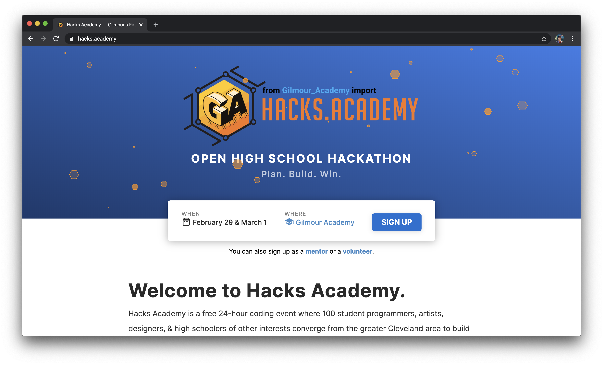
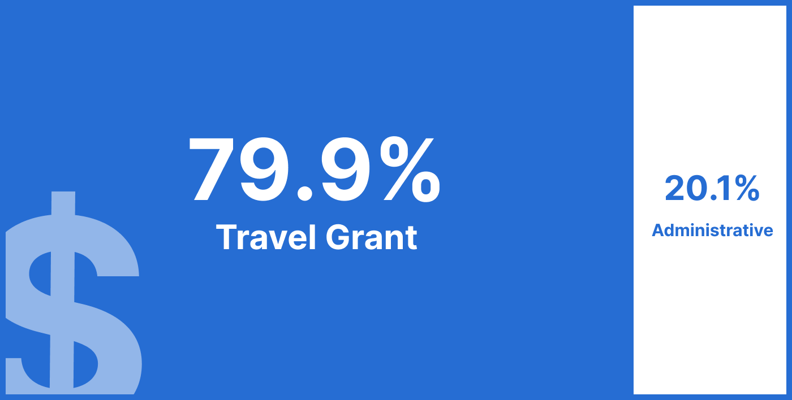

## Why Execute Big?

In July of 2019, I helped run the fifth and final hackathon of my high school career. Finally, my hackathon experience had come full circle: my last hackathon happened at the University of Cincinnati—the exact place where my journey had first started in 2016.

This was both frightening and freeing. While I wanted nothing more than to continue advocating for technology literacy and educational accessibility, I had no idea if or how I'd stay involved in the hackathon scene I'd thrown years of work into. I had spent so much time emailing companies and calling people and buying stuff that I'd never documented my learnings over the course of three tumultuous, rewarding years of hackathon organizing. 

In July of 2019, I started working at Hack Club HQ in San Francisco with Mingjie. Initially tasked with facilitating effective leadership transitions, our focus soon became a race against time to pry all of the acquired knowledge about running clubs and hackathons out of my brain. After all, at the end of August, I was going off to college where, we feared, I'd forget how to email companies, how to train a leadership team, and, eventually, how to run a hackathon.

Later that month, Sean, Mingjie and I also reunited at the Flagship Summit in San Francisco. As we munched on burritos and boba at a hostel in San Francisco one night, we had a crazy idea —*what if, instead of running events everywhere, we funded students to jet across the country and go to hackathons?*

The few thousand dollars left over from Hack Chicago 2018 became the seed fund for a travel grant program for talented, less privileged high school students to attend the nation's best high school hackathons.
In August, we founded Execute Big, a nonprofit under Hack Club dedicated to giving every student the opportunity to experience the beauty of computer science. 

We officially launched the [travel scholarship](/grant) we'd dreamt up. We partnered with schools as consultants to run [hackathons](/events) for them. We shipped an [advising](/advising) resource for student hackathon organizers (details will be in Q2).
Through these innovative, unique programs, we've found our way to stay involved and continue making an impact—just take a look.

---

## Travel Grant

Since November of 2019, Execute Big has awarded **well over $1,500 in travel grants** to students all across the country. Here are some notable numbers:

* **67%** of grant recipients identified as female while **33%** identified as male;
* **83%** of recipients were people of color;
* **83%** of recipients were part of underrepresented minorities in the tech industry;
* 50% of recipients were from the Midwest, 33% were from the West, and 17% from the South;
* Of hackathons that recipients attended, 60% were on the West Coast, 20% in the South, and 20% in the Northeast;
* Of hackathons that recipients attended, 60% were directly catered toward underrepresented minorities in the tech industry (such as all non-binary/female hackathons, etc.).

What's important to note is the high levels of representation from students from **disadvantaged geographic regions** (such as the Midwest and the South) and underrepresented demographics (such as women and people of color) attending events in **opportunity-filled areas** (such as the West and Northeast). 

On top of funding students, Execute Big has made it possible for hackathons to reach students outside of their region —our travel grant has also been **listed on 15 hackathons' websites** (and counting!), with students also applying to attend non-listed events outside of our direct community.

---

## Hackathon Consulting for Schools

Many schools want to run hackathons, but few have the time or know-how to actually run an event. That's where Execute Big comes in-using our understanding of hackathons, running events, and all the nitty-gritty details, we help schools run amazing hackathons for students in their community.

Since October of 2019, we've been working as hackathon event consultants with Gilmour Academy to launch and run [Hacks Academy](https://hacks.academy), their first hackathon. The event is completely free to attend and is set to run from February 29th to March 1st, 2020 for **75 high school students in the Cleveland metropolitan area**.

Hacks Academy will be the second event that Execute Big has organized as a part of the hackathon consulting program.

---

## Finances

Starting an organization like Execute Big could be expensive, but we try to keep our costs at a minimum. In addition to Hack Chicago's seeding funds, we also received close to $2,000 in donations from Hack Cincinnati, an event that happened over summer of 2019.

During our first few months, we had to pay for small administrative item like branding and marketing material (domain, networking, etc.), yet the majority of our expenses are still taken up by Travel Grant. **79.9%** of our Q1 (November 2019 — January 2020) expenses are used to provide travel reimbursements for students, with administrative expenses taking up the other 20.1%. 

In the next few months, we're going to see an increase in funding spent on students. With minimal administrative expenses expected, we want to spend over 95% of our future funding directly on students.

---

## Impact Statement

Execute Big is filling a niche in the technology industry that has been overlooked by giant companies and individuals alike. With our experience and dedication to the cause of educational accessibility, we hope to continue helping students dream big and execute big.

*&mdash; In Cambridge, MA*

---

### About Execute Big

*Execute Big is a student-run non-profit organization dedicated to creating innovative and
purpose-driven educational programs around the United States. Contributions to Execute Big are tax-deductible.*

[Donate](/donate/pay)&ensp;&middot;&ensp;[Contact](mailto:team@executebig.org)
